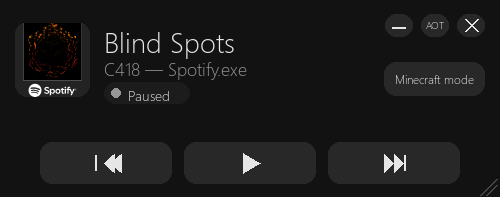
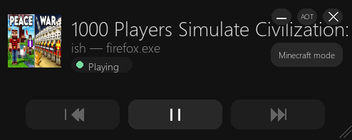

 # Better Windows Media Controller

_A modern borderless SMTC remote built with Python, Pygame, and Windows 10/11’s System Media Transport Controls._

|  |
|:-------------------:|
| Works with spotify  |

|  |
|:-----------------------:|
|       And youtube       |

---

## Overview

This project is a fully custom, borderless media controller for Windows that communicates directly with the Windows System Media Transport Controls (SMTC) API.
It provides real-time control and playback information for Spotify, browser players, system media sessions, and any other application that registers with SMTC.

The UI is rendered in Pygame.

This tool aims to replace the clunky Windows media overlay with something that is:

* Beautiful (borderless, scalable UI)
* Responsive (no freezing, doesn't fade away)
* Feature-rich
* Lightweight
* Just better don't use the windows junk

---

## Features:

* Pause/Play buttons
* Previous button
* Next button
* 'Chips' that show stats like Paused/Playing, whether AOT is on, or when Minecraft Mode is on
* Resize drag area on the bottom right
* Always On Top (AOT) button to always display the app on top
* Minecraft Mode (initial reason for creating this whole app) that pauses playback for 5 minutes after each song ends
* Minimize button
* Close the app button

### Minecraft Mode, a fun optional button inspired by Minecraft’s soundtrack transitions.

1. Pauses the player every time a track changes
2. Displays a progress bar counting down
3. Resumes playback after a delay (default 5 minutes)
4. Delay is fully customizable in code

---

# Installation 

## Requirements
* Windows 10 or Windows 11
* Python 3.9+ (I use 3.12.6)

## Dependencies:
Install using pip:
```bash
pip install winsdk pygame pillow
```

---

# Known bugs/issues:

- Only works on windows
  - I don't really care to port to other OS nor am I aware that they have similar functionality to Windows Media Player

- When in Minecraft mode, resuming the media from an external source while the timer is running does not stop the timer
    - I can't be bothered to fix a silly edge case like this, too lazy everything else works `¯\_(ツ)_/¯`

- Media with names too long overflow off the edge and disappear (visible in second screenshot)
    - Watch shorter things I don't really want to fix this